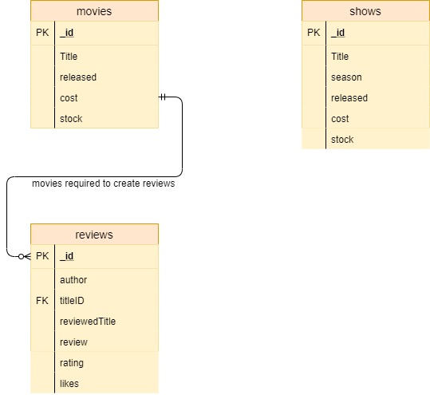

# MovieLovers- Frontend

## Ryan Mckenna - 20076596

### routes and models
- Movies model & Movie route 
- shows model & Show route 
- Reviews model & Review route 

The movieLovers app had 3 models and routes (movies, shows, and reviews) there are get requests for  findAllMovies, Shows, and reviews, with a path like */movie*. 

The are also findByID's for each of them. With paths like */show/:id*. Reviews also has a findByAuthor which searches the review authors and returns reviews by the searched name.  and the findByAuthor path was */review/author/:author*  

Both movie and show have put purchase(Movie/Show) this lower the stock by one but does not put anything into a checkout box yet.
neither a movie or review can be deleted with anything greater then 0 in their stock.

Delete movie or show had a path */show/:id/:stock* this was as the deleteMove and deleteShow could only work if the stock was empty as it is for site maintance and they would not want to delete a movie they still have in stock.

## Data model.

 The data model is made of three models. movies, shows, and reviews. movies and shows can be purchased, this lowers the stock.
 Both movies and shows can only be deleted if their stock is at zero. this is to stop admin accidentally removing a show or movie and 
 having a stock of them with no record.
   A review can only be writen about a movie if the movieID is found in the movies model. Reviews also have a likes system that is zero by default. 
 
### movies 
~~~
[
    {
        "_id", "5dc196ab8f003d462cbc23b0",
        "title", "Avatar",
        "released", "2012",
        "cost", 24,
        "stock", 133
    }
]
~~~

### shows

~~~
[
    {
        "_id", "5dc196ab8f003d462cbc2395",
        "title", "The boys",
        "released", "2019",
        "cost", 10,
        "stock", 1765
    }
]
~~~

### reviews
~~~
[
    {
        "_id", "5dc196aa8f003d462cbc2366",
        "author", "Joe Johnson"
        "titleID", "5dc196ab8f003d462cbc23b0",
        "reviewedTitle", "Avatar",
        "review", "master piece",
        "rating", 8,
        "likes", 1
    }
]
~~~

### persistense
I had a mongodb database and connect to mongodb.atlas

### git
used github for my repo

### DX approach 
I tried using agile method to develop the app building and scaling the app gradually making improvements to all features.

### youtube
my demo: https://youtu.be/mwOupTYrtyQ

### hosted
hosted: http://movielovers-vue.surge.sh  
however the backend is not hosted so required backend localhost.

### references

deleting : https://jsao.io/2018/04/creating-a-rest-api-handling-post-put-and-delete-requests/  
put request issues: https://www.youtube.com/playlist?list=PL4cUxeGkcC9jBcybHMTIia56aV21o2cZ8  
lab notes: https://tutors-design.netlify.com/course/wit-wad-2-2019.netlify.com  
surge: https://medium.com/jubianchi-fr/preview-your-website-with-gitlab-ci-and-surge-5b861d7c9a3a
